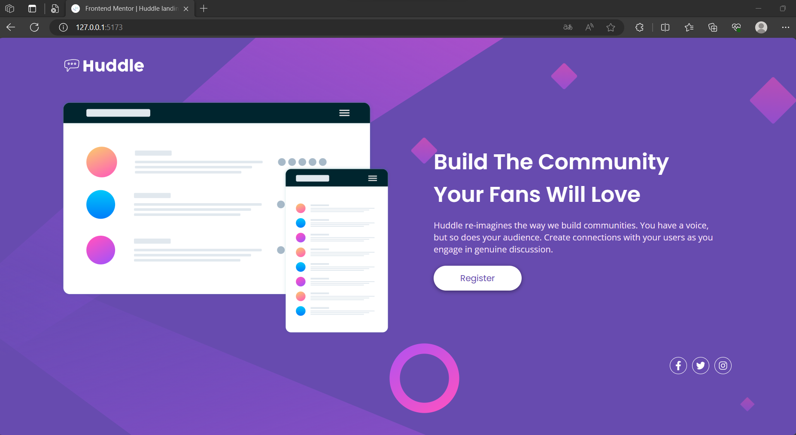

# Frontend Mentor - Huddle landing page with single introductory section solution

This is a solution to the [Huddle landing page with single introductory section challenge on Frontend Mentor](https://www.frontendmentor.io/challenges/huddle-landing-page-with-a-single-introductory-section-B_2Wvxgi0).

## Table of contents

- [Overview](#overview)
  - [The challenge](#the-challenge)
  - [Screenshot](#screenshot)
  - [Live Link](#links)
- [My process](#my-process)
  - [Built with](#built-with)
  - [What I learned](#what-i-learned)
  - [Continued development](#continued-development)
- [Author](#author)

## Overview

### The challenge

Users should be able to:

- View the optimal layout for the page depending on their device's screen size
- See hover states for all interactive elements on the page

### Screenshot



### Links

- Live Site URL: [Add live site URL here](https://your-live-site-url.com)

## My process

### Built with

- Semantic HTML5 markup
- CSS custom properties
- Flexbox
- CSS Grid
- Mobile-first workflow
- [React](https://reactjs.org/) + [Vite](https://vitejs.dev/)
- [Vitest](https://vitest.dev/) with [React Testing Library](https://testing-library.com/)

### What I learned

In this project, my main goal was to enhance my HTML and CSS skills while simultaneously incorporating the fundamental features of React ( such as JSX and components). Later on, I decided to embark on the journey of testing the components I had developed. To achieve this, I utilized React Testing Library with Vitest to improve my abilities in writing tests.

Below, you can see an example of a test code I wrote for this project.

```javascript
let iconsRenderResult;
let iconsElement;

beforeEach(() => {
  iconsRenderResult = render(<Icons />);
  iconsElement = iconsRenderResult.getByTestId('icons');
});

test('renders Icons component correctly', () => {
  expect(iconsElement).toBeTruthy();
});
```

### Continued development

To stay true to the original project, I didn't incorporate any user interactions (such as clicking buttons) or dynamic features. However, I might consider making the project more user interactive in the future.

## Author

💼 **LinkedIn**: <a title="Meryem Çetinkaya | LinkedIn" href="https://www.linkedin.com/in/meryem-cetinkaya/" target="_blank">Meryem Çetinkaya</a><br/>
🐈‍⬛ **GitHub**: <a title="Meryem Çetinkaya | GitHub" href="https://github.com/meryemctnky" target="_blank">Meryem Çetinkaya</a><br/>
📩 **E-mail**: <a title="meryemctnkya@gmail.com" href="mailto:meryemctnkya@gmail.com" target="_blank">meryemctnkya@gmail.com</a><br/><br/>
